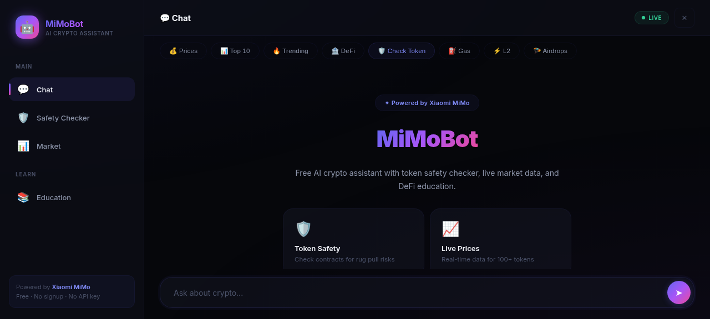
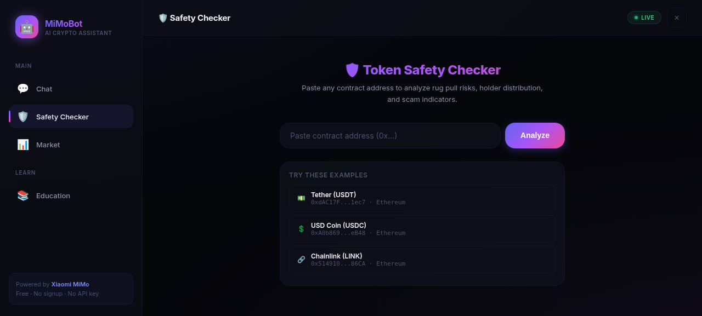
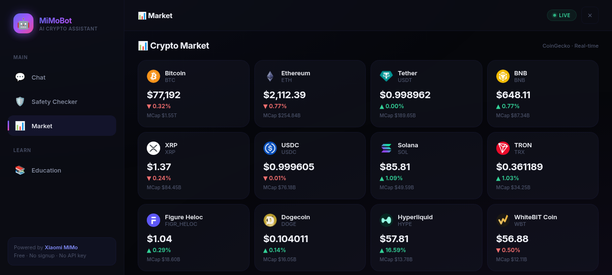
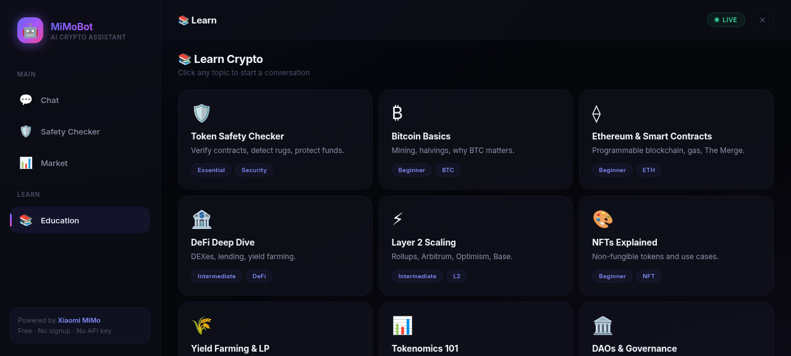
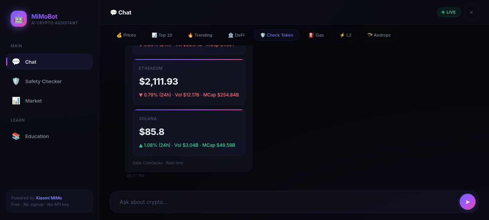

# MiMoBot — AI Crypto Assistant

Free AI-powered crypto assistant with token safety checker, live market data, and DeFi education.

**Powered by Xiaomi MiMo** · Free · No signup · No API key

🔗 **Live:** https://huolinger010.github.io/mimobot

---

## Features

- 🛡️ **Token Safety Checker** — Analyze contracts for rug pull risks, holder distribution, and scam indicators
- 📈 **Live Prices** — Real-time data for 100+ tokens via CoinGecko
- 📊 **Market Overview** — Top coins, trending, gainers, losers
- 🏦 **DeFi Education** — Yield farming, LP, protocols, and more
- ⚡ **Fast & Free** — No API keys, no signup, no credit card

## Screenshots

### Welcome Screen (Desktop)

### Token Safety Checker

### Market Overview

### Learn Crypto

### Chat with Price Data

## Tech Stack

- **Frontend:** Single-file HTML/CSS/JS (no frameworks, no build step)
- **AI Model:** Xiaomi MiMo (via API)
- **Market Data:** CoinGecko API (free tier)
- **Hosting:** GitHub Pages

## How to Use

1. Visit https://huolinger010.github.io/mimobot
2. Use the sidebar/bottom nav to switch between tabs
3. Chat with MiMoBot about crypto topics
4. Check token safety by pasting a contract address
5. View live market data and learn about DeFi

## Mobile Support

- Responsive design with bottom navigation bar
- Touch-friendly targets
- Safe area insets for notch/home indicator
- Fluid typography with clamp()

## License

MIT
# Updated
